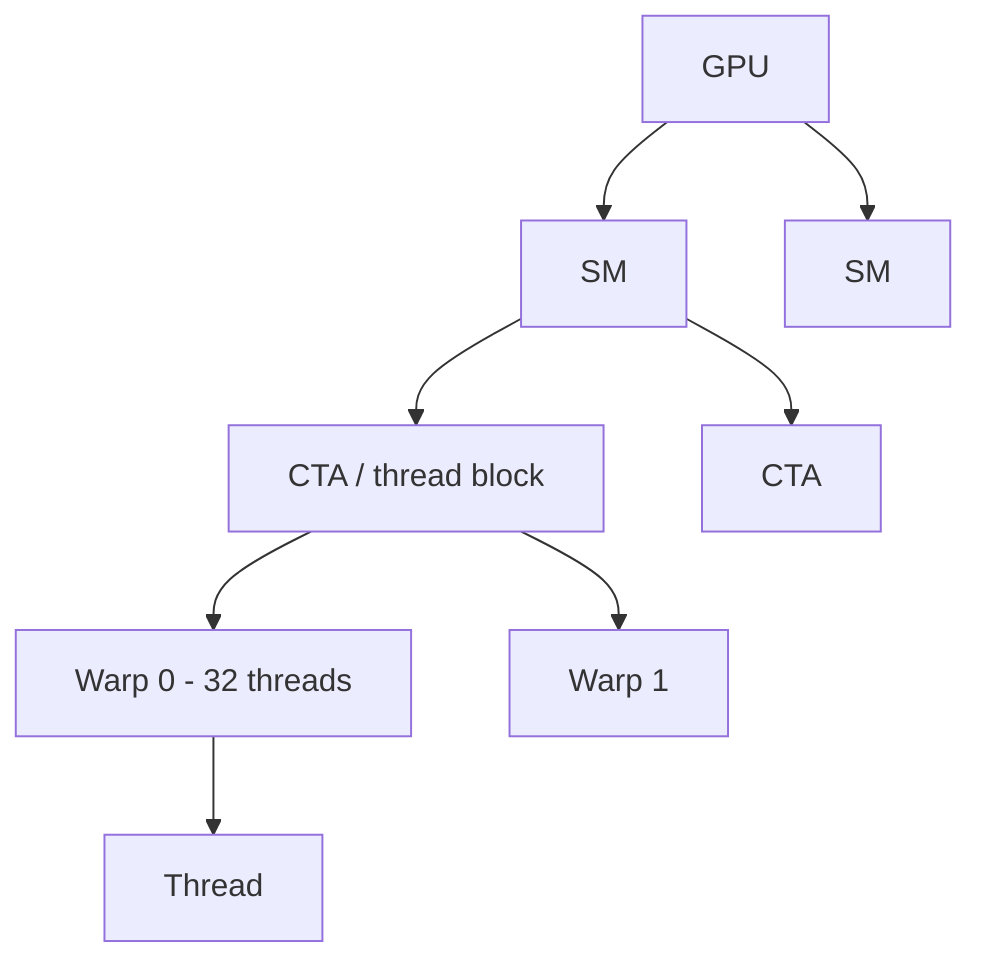

# 01 — GPU Primer for ML Engineers

You do not need to become a CUDA expert to contribute to FlashAttention. You *do* need a mental model of **where data lives** and **who does the work**. This chapter builds that model.

## The three places data lives

| Level | Typical name | Size (order of magnitude) | Latency / bandwidth | Who can see it |
|-------|--------------|---------------------------|---------------------|----------------|
| Device DRAM | **HBM** (High Bandwidth Memory) | Tens of GB | High bandwidth, still “slow” vs compute | Entire GPU |
| On-chip scratch | **SRAM** / shared memory (SMEM) | ~100–228 KB per SM | Much faster, much smaller | Threads in one CTA (thread block) |
| Per-thread | **Registers** | ~256 KB register file per SM, partitioned | Fastest | One thread (or warp via shuffles) |

**Key intuition:** Modern GPUs can do far more FLOPs per second than HBM can feed. Attention at long sequence lengths is often **memory-bound** (waiting on HBM), not compute-bound. FlashAttention’s core idea is to **cut HBM traffic** by keeping intermediate tiles in SRAM.

See [diagrams/memory-hierarchy.md](diagrams/memory-hierarchy.md) for a visual.

## Threads → warps → CTAs → SMs



- **Thread:** One lane of execution. Holds registers.
- **Warp:** 32 threads that execute in lockstep (SIMT). Reductions and shuffles happen here.
- **CTA (Cooperative Thread Array) / thread block:** Group of warps that share **shared memory** and can synchronize with `__syncthreads()` / barriers.
- **SM (Streaming Multiprocessor):** Hardware unit that schedules CTAs. Has a fixed shared-memory and register budget.
- **Grid:** All CTAs launched for one kernel.

FlashAttention kernels typically assign **one (or a few) CTA(s)** to a tile of query rows for a given batch and head. Understanding that mapping is half of reading any FA kernel.

## Why HBM vs SRAM matters for attention

Naïve attention for sequence length `N`, head dim `d`:

1. Compute `S = QKᵀ` → shape `(N, N)` — **write O(N²) to HBM**
2. Softmax over rows of `S` → another O(N²) traffic
3. Multiply by `V` → read O(N²) scores again

Even if each FLOP is cheap, **moving the N×N score matrix** dominates for large `N`. FlashAttention never materializes that full matrix in HBM; it streams K/V tiles through SRAM while accumulating the output.

Rough rule of thumb from the FA1 paper: if arithmetic intensity (FLOPs / bytes moved) is low, you are HBM-bound. Tiling + fusion raises arithmetic intensity.

## Occupancy and tile size (why kernels obsess over BLOCK_M / BLOCK_N)

A CTA needs:

- Enough **shared memory** for Q/K/V (and sometimes O) tiles
- Enough **registers** for accumulators (`acc_o`, row max/sum)
- Enough **warps** to hide memory latency

Larger tiles → better reuse of data loaded from HBM → fewer HBM bytes per FLOP — **until** you spill registers or exceed SMEM and occupancy collapses. That is why every generation has carefully chosen `kBlockM` / `kBlockN` (or Triton `BLOCK_M` / `BLOCK_N`) heuristics.

## Async copies and tensor cores (preview)

You will see these acronyms later; here is the one-line version:

| Feature | Arch (approx.) | Role in FlashAttention |
|---------|----------------|------------------------|
| Tensor cores / MMA | Volta+ | Fast tile GEMMs for QKᵀ and PV |
| `cp.async` | Ampere (SM80) | Overlap HBM→SMEM copies with compute |
| **TMA** (Tensor Memory Accelerator) | Hopper (SM90) | Hardware bulk async copies |
| **WGMMA / GMMA** | Hopper | Warp-group matrix multiply |
| **UMMA / tcgen05** | Blackwell (SM100) | Next-gen MMA; FA4 uses 2CTA modes |

FA2 leans on Ampere `cp.async` + MMA. FA3/FA4 on Hopper lean on TMA + warp specialization. FA4 on Blackwell adds UMMA, persistent scheduling, and 2CTA.

## What “kernel fusion” means

A **kernel** is one GPU program launch. Naïve attention might be:

```
kernel1: S = Q @ K.T     # write S to HBM
kernel2: P = softmax(S)  # read S, write P
kernel3: O = P @ V       # read P and V, write O
```

FlashAttention fuses these into **one** (or a small number of) kernel(s) so intermediates stay in registers/SMEM. Fusion is not just fewer launches — it is the mechanism that makes tiling useful.

## Mental checklist before reading kernels

When you open any FlashAttention forward kernel, ask:

1. **Who owns the Q tile?** (usually this CTA’s rows of Q)
2. **How do K/V tiles stream?** (loop over `n` blocks)
3. **Where do `row_max` / `row_sum` (or LSE) live?** (registers)
4. **When is O written to HBM?** (once, after the loop — or partial + combine for SplitKV)
5. **What is in shared memory right now?** (current Q and/or K/V stages)

If you can answer those five, you understand the kernel’s structure.

## Next

[02 — IO bottleneck and tiling](02-theory-io-and-tiling.md)
