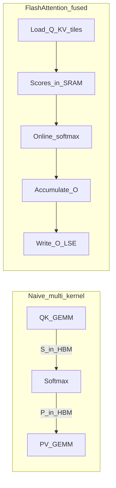

# 02 — IO Bottleneck, Tiling, and Kernel Fusion

Paper anchor: [FlashAttention (Dao et al., 2022)](https://arxiv.org/abs/2205.14135) — Sections on IO-awareness and the FlashAttention algorithm.

## The naïve algorithm (what you already know)

For one head, with `Q, K, V ∈ ℝ^{N×d}`:

```
S = (Q @ K.T) * scale     # N×N
P = softmax(S, dim=-1)    # N×N
O = P @ V                 # N×d
```

Correct, simple, and **disastrous for memory** at long `N`:

- Stores `S` and often `P` in HBM: **Θ(N²)** extra memory
- Reads/writes those matrices multiple times: **Θ(N²)** HBM traffic
- Softmax needs the full row (or a reduction pass), encouraging materialization

Training a 8k–32k context transformer without fused attention often OOMs or crawls — not because FLOPs exploded alone, but because the **score matrix** did.

## The IO bottleneck, in one sentence

> At long sequence lengths, attention is limited by **how many times you move the N×N scores through HBM**, not by how fast tensor cores multiply.

Compare approximate costs (order of magnitude):

| Work | FLOPs | HBM bytes (naïve) |
|------|-------|-------------------|
| QKᵀ | O(N² d) | O(N²) writes for S |
| Softmax | O(N²) | O(N²) read/write |
| PV | O(N² d) | O(N²) reads for P |

FLOPs scale like N²d; **bytes for scores scale like N²**. When `d` is 64–128, moving scores is a huge fraction of the wall-clock time.

## Tiling: the same math, blocked

Classic GEMM optimization: multiply matrices in **tiles** that fit in fast memory.

For attention:

1. Split Q into blocks of `Br` rows (`BLOCK_M` / `kBlockM`)
2. Split K/V into blocks of `Bc` rows (`BLOCK_N` / `kBlockN`)
3. For each Q-block, loop over K/V-blocks:
   - Load Q-tile (once) and K/V-tile (each iteration) into SRAM
   - Compute a `Br × Bc` piece of scores
   - Update the running softmax statistics and output accumulator
4. Write the finished O-block (and LSE) back to HBM

```text
Q tiles (rows):     [ Q0 | Q1 | Q2 | ... ]
                      │
                      ▼  for each Qi, stream K/V tiles →
K/V tiles (cols):   [ K0 V0 | K1 V1 | K2 V2 | ... ]
```

**Why this helps:** Each byte of K/V loaded from HBM is reused across `Br` query rows sitting in SRAM/registers. The full N×N matrix never exists.

See [diagrams/memory-hierarchy.md](diagrams/memory-hierarchy.md).

## Kernel fusion: keep tiles on-chip

Tiling alone is not enough if each micro-op still writes intermediates to HBM. FlashAttention **fuses**:

- Score tile GEMM
- Softmax update (online — next chapter)
- Output tile GEMM

into one kernel so the `Br × Bc` score tile lives only in registers/SMEM.

Naïve multi-kernel vs fused:



## Exact attention (not an approximation)

FlashAttention computes the **same mathematical result** as standard attention (up to floating-point associativity). It is **not** sparse attention, linear attention, or a low-rank approximation. The win is IO, not a changed formula.

(That matters when debugging: numerical diffs vs a PyTorch reference should be small — rtol/atol in tests — not “approximately similar.”)

## Memory complexity win

| Method | Extra memory beyond Q/K/V/O |
|--------|-----------------------------|
| Naïve | Θ(N²) for scores |
| FlashAttention | Θ(N) for LSE (log-sum-exp) / row statistics, plus workspace for some features |

This is why long-context training became practical: you can fit larger `N` before OOM.

## Causal and local masking fit naturally

Causal attention only needs K/V blocks up to the diagonal. The tiled loop simply **shortens the `n`-block range** for each Q-block (see `block_info` in FA4, causal branches in Triton/FA2). Local / sliding-window attention similarly restricts the K/V block range. You still never build a full mask matrix of size N×N in HBM.

## What tiling does *not* solve by itself

- **Parallelism across Q-blocks** — FA1 left performance on the table; FA2 improved work partitioning ([04](04-theory-parallelism.md))
- **Hardware async copy engines** — FA3/FA4 exploit TMA and warp specialization
- **Very long KV with decode** — paged KV, SplitKV, GQA packing are later engineering layers

## Checkpoint questions

1. Why is storing `S ∈ ℝ^{N×N}` worse than storing `O ∈ ℝ^{N×d}` for large N?
2. If `BLOCK_M = BLOCK_N = 128` and `N = 4096`, how many K/V tile iterations does one Q-block perform (non-causal)?
3. Where do score tiles live in FlashAttention vs naïve attention?

## Next

[03 — Online softmax](03-theory-online-softmax.md)
