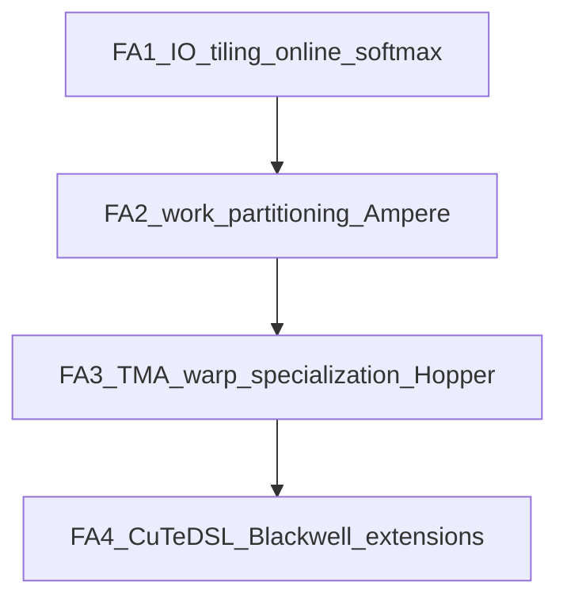

# 04 — Parallelism Evolution (FA1 → FA4)

Tiling + online softmax explain **correctness and memory**. The generational papers mostly answer: **how do we keep the GPU busy?**

## FA1: IO-aware algorithm, first GPU implementation

[FlashAttention paper](https://arxiv.org/abs/2205.14135)

- Established HBM/SRAM analysis and the tiled online-softmax algorithm
- CUDA implementation proved large speedups vs PyTorch / naïve fused baselines
- Work partitioning left headroom: not all SMs stayed equally busy; parallelism across sequence and heads could be improved

**Mental model:** “We proved attention can be IO-efficient.”

## FA2: better parallelism and work partitioning

[FlashAttention-2 paper](https://tridao.me/publications/flash2/flash2.pdf)

Focus areas (read the paper’s parallelism section carefully):

1. **Parallelize over sequence dimension more effectively** — reduce under-utilization when batch × heads is small
2. **Work partitioning within a CTA** — split warps across Q-rows / K-tiles so shared memory and tensor cores stay fed
3. **Fewer non-matmul ops** in the inner loop (rescale, etc.) relative to FA1

In this repo, FA2 lives as production CUDA in [`csrc/flash_attn/`](../csrc/flash_attn/) with Python entry [`flash_attn/flash_attn_interface.py`](../flash_attn/flash_attn_interface.py).

Typical FA2 forward grid (simplified):

```text
grid = (num_m_blocks, batch, num_heads)
```

Each CTA owns one Q-row-block for one `(batch, head)`. See [diagrams/kernel-execution.md](diagrams/kernel-execution.md).

**Mental model:** “Same algorithm, schedule the work so Ampere GPUs actually saturate.”

## FA3: Hopper asynchrony, warp specialization, FP8

[FlashAttention-3 paper](https://tridao.me/publications/flash3/flash3.pdf) · [blog](https://tridao.me/blog/2024/flash3/)

Hopper (H100) adds hardware that changes kernel *shape*:

| Feature | Why it matters for attention |
|---------|------------------------------|
| **TMA** | Async bulk tensor copies; producer warps issue loads without tying up tensor cores |
| **WGMMA** | Large warp-group matrix multiplies |
| **Warp specialization** | Some warps only load (producer), others only compute softmax/MMA (consumer), overlapped via pipelines |
| **FP8** | Higher throughput on Hopper tensor cores for inference-friendly dtypes |

Repo home: [`hopper/`](../hopper/), especially [`mainloop_fwd_sm90_tma_gmma_ws.hpp`](../hopper/mainloop_fwd_sm90_tma_gmma_ws.hpp).

**Mental model:** “Overlap memory and math like a CPU pipelined processor, but with producer/consumer warps.”

## FA4: CuTeDSL, Blackwell, and programmable extensions

Paper: [`assets/fa4_paper.pdf`](../assets/fa4_paper.pdf) · code: [`flash_attn/cute/`](../flash_attn/cute/)

FA4 re-implements the algorithm in **CuTeDSL** (Python → PTX/CUBIN JIT) targeting Hopper and Blackwell:

- **SM90:** TMA / WGMMA-style path in [`flash_fwd_sm90.py`](../flash_attn/cute/flash_fwd_sm90.py)
- **SM100:** UMMA, **2CTA**, SplitKV, persistent scheduling in [`flash_fwd_sm100.py`](../flash_attn/cute/flash_fwd_sm100.py)
- **Extensions first-class:** `score_mod`, `mask_mod`, block sparsity, paged KV, PackGQA

Why Python DSL instead of only C++ templates?

- Faster iteration for new GPU features and research hooks (FlexAttention-style mods)
- Compile cache still produces optimized CUBIN ([`cache_utils.py`](../flash_attn/cute/cache_utils.py))
- Same mathematical core: tiled online softmax

**Mental model:** “Production + research platform on modern NVIDIA GPUs; FA2/FA3 ideas, new programming model.”

## SplitKV (when one Q-block is not enough)

For very long `N` or latency-sensitive decode, multiple CTAs can cooperatively process **different K/V slices** for the same Q-block, writing **partial O and LSE**, then a **combine** kernel merges them ([`flash_fwd_combine.py`](../flash_attn/cute/flash_fwd_combine.py)).

This is another parallelism axis: parallelize over **KV length**, not only over Q blocks. Combining LSEs is exactly online-softmax algebra at the CTA level — get it wrong and you get subtle numerical bugs.

## GQA / MQA and PackGQA

Grouped-query attention means fewer KV heads than Q heads. Kernels either:

- Loop Q-heads that share a KV head, or
- **PackGQA:** pack multiple Q heads into the tile so MMA shapes stay efficient ([`pack_gqa.py`](../flash_attn/cute/pack_gqa.py))

This is work partitioning driven by **model architecture**, not just GPU SMs.

## Evolution summary



| Gen | Primary bottleneck addressed |
|-----|------------------------------|
| FA1 | HBM traffic / memory footprint |
| FA2 | SM under-utilization, CTA-internal scheduling |
| FA3 | Copy-compute overlap on Hopper, low-precision |
| FA4 | New archs + maintainable extensibility |

## Next

[05 — Papers and history](05-papers-and-history.md)
