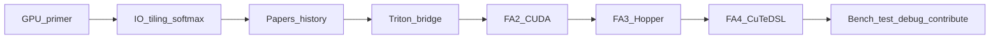

# FlashAttention Onboarding Guide

A study path from “I know transformer attention” to “I can read, benchmark, modify, and contribute to FlashAttention.”

This guide assumes you understand standard attention (`softmax(QKᵀ / √d) V`) at a high level, but are new to GPU kernel programming. The contribution target is **FlashAttention-4** in [`flash_attn/cute/`](../flash_attn/cute/). Earlier generations (Triton experiments, FA2 CUDA, FA3 Hopper) teach the same ideas with increasing hardware sophistication.

## Prerequisites

- Comfortable with PyTorch tensors and basic linear algebra
- Rough familiarity with transformers (Q/K/V, multi-head attention, causal masking)
- A Linux machine with an NVIDIA GPU is ideal for the practice chapters; you can still read everything without one
- Optional but helpful: skim the [CUDA C++ Programming Guide](https://docs.nvidia.com/cuda/cuda-c-programming-guide/) sections on the memory hierarchy (you do not need to write CUDA yet)

## How to use this guide

Follow [`16-reading-order.md`](16-reading-order.md) for a 2–4 week path. Or jump by topic:

| Part | Chapters | Purpose |
|------|----------|---------|
| **Theory** | [01](01-gpu-primer.md)–[05](05-papers-and-history.md) | Hardware mental model + why FlashAttention exists |
| **Implementation** | [06](06-repo-map.md)–[11](11-dispatch-shapes-layouts.md) | Map ideas onto Triton / FA2 / FA3 / FA4 code |
| **Practice** | [12](12-benchmarks-and-perf.md)–[16](16-reading-order.md) | Benchmark, test, debug, extend, contribute |
| **Diagrams** | [`diagrams/`](diagrams/) ([index](diagrams/README.md)) | Memory, softmax flow, execution, call graphs |

## Pedagogical arc

## Chapter index

1. [GPU primer](01-gpu-primer.md) — threads, warps, SMs, HBM vs SRAM
2. [IO bottleneck and tiling](02-theory-io-and-tiling.md) — why naïve attention is memory-bound
3. [Online softmax](03-theory-online-softmax.md) — exact attention without materializing `S`
4. [Parallelism evolution](04-theory-parallelism.md) — FA2 work partitioning → FA3/FA4 hardware features
5. [Papers and history](05-papers-and-history.md) — FA1–FA4 paper ↔ repo crosswalk
6. [Repo map](06-repo-map.md) — generations, ~25 key files, what to ignore
7. [Triton kernels](07-triton-kernels.md) — readable fused attention as a teaching bridge
8. [FA2 CUDA](08-fa2-cuda.md) — production Ampere+ kernels in `csrc/`
9. [FA3 Hopper](09-fa3-hopper.md) — TMA, warp-specialized GMMA
10. [FA4 CuTeDSL](10-fa4-cute.md) — active development path
11. [Dispatch, shapes, layouts](11-dispatch-shapes-layouts.md) — APIs, arch selection, tensor layouts
12. [Benchmarks and performance](12-benchmarks-and-perf.md) — measuring TFLOPS the right way
13. [Testing infrastructure](13-testing-infrastructure.md) — pytest, FakeTensor two-pass CI
14. [Debugging and pitfalls](14-debugging-and-pitfalls.md) — hangs, races, numerical issues
15. [Extensions and contributing](15-extensions-and-contributing.md) — score/mask mods, PR workflow
16. [Reading order](16-reading-order.md) — progressive checklist with checkpoints

## Papers (keep these open)

| Gen | Paper | Local / link |
|-----|-------|----------------|
| FA1 | [FlashAttention (Dao et al., 2022)](https://arxiv.org/abs/2205.14135) | IO-awareness, tiling, online softmax |
| FA2 | [FlashAttention-2](https://tridao.me/publications/flash2/flash2.pdf) | Better parallelism and work partitioning |
| FA3 | [FlashAttention-3](https://tridao.me/publications/flash3/flash3.pdf) ([blog](https://tridao.me/blog/2024/flash3/)) | Hopper: asynchrony, FP8, warp specialization |
| FA4 | FlashAttention-4 | [`assets/fa4_paper.pdf`](../assets/fa4_paper.pdf) |

## What to ignore initially

Do **not** start here (details in [06-repo-map.md](06-repo-map.md)):

- ROCm / AMD: `csrc/flash_attn_ck/`, `csrc/composable_kernel/`, `third_party/aiter`
- Windows packaging paths in root `setup.py`
- Wheel publish workflows (`.github/workflows/publish*.yml`)
- Training demo and model zoo: `training/`, `flash_attn/models/`, `modules/`, `layers/`
- Side CUDA ops: `csrc/fused_dense_lib/`, `csrc/layer_norm/`
- Legacy blocksparse: `flash_attn/flash_blocksparse_*`
- Wholesale vendor trees: `csrc/cutlass/`

## Related repo docs (not rewritten here)

- [`CLAUDE.md`](../CLAUDE.md) / [`AGENTS.md`](../AGENTS.md) — agent-oriented architecture cheat sheet
- [`AI/`](../AI/) — deep kernel-debug playbooks (2CTA hangs, racecheck, CLC, SASS)
- Root [`README.md`](../README.md) — install and user-facing API
- [`flash_attn/cute/README.md`](../flash_attn/cute/README.md) — FA4 install / dev

## Success criteria

You are “onboarded” when you can:

1. Explain why FlashAttention is faster *and* more memory-efficient than naïve attention, in IO terms
2. Trace a forward call from Python API → arch dispatch → tiled online-softmax loop → O/LSE write
3. Point to where tiling, softmax rescale, causal masking, and SplitKV live in FA4
4. Run a fast correctness test and a TFLOPS benchmark
5. Propose a small, well-scoped contribution (test, heuristic, score_mod, docs, or kernel fix)
