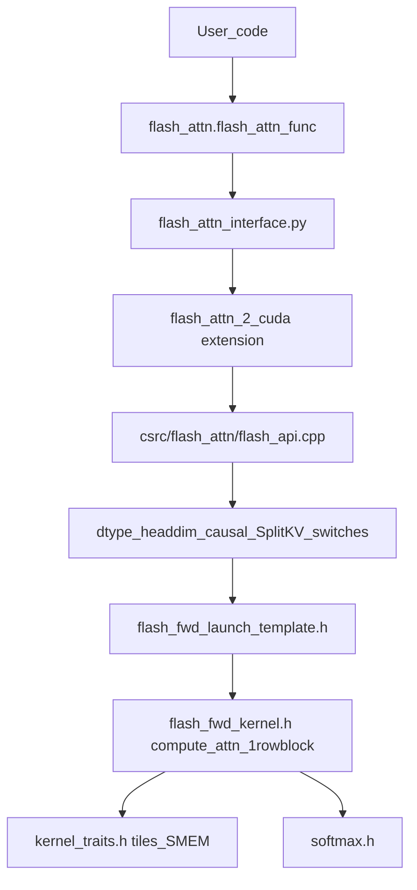
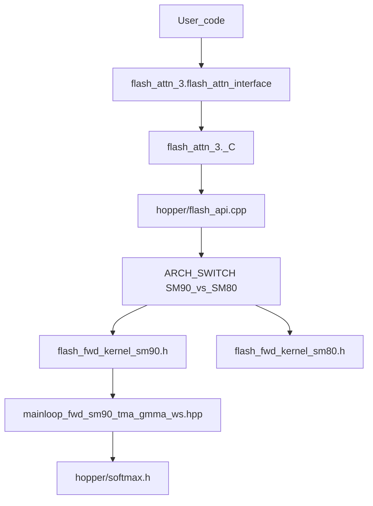
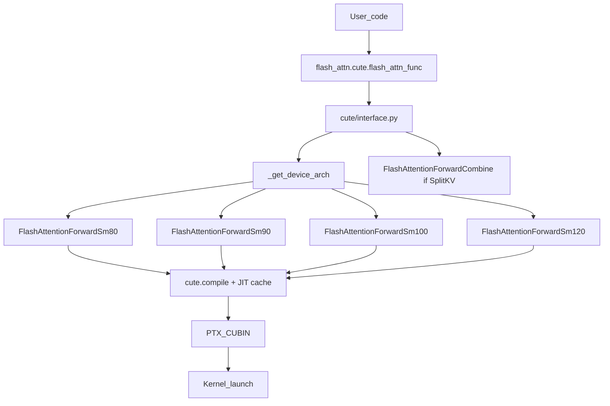
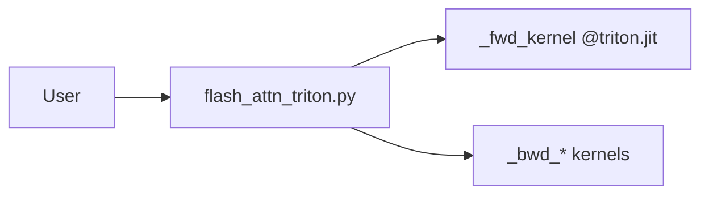

# Diagram: Call Graphs

Companion to [11-dispatch-shapes-layouts.md](../11-dispatch-shapes-layouts.md).

## FA2 (root `flash_attn`)

Backward: `flash_api.cpp` → `flash_bwd_launch_template.h` → `flash_bwd_kernel.h` (+ preprocess/postprocess for dQ/dK/dV).

## FA3 (`hopper/` → `flash_attn_3`)

## FA4 (`flash_attn.cute`)

Compile keys include dtype, head dim, causal, tile sizes, mask/score_mod hashes, arch — see [`cache_utils.py`](../../flash_attn/cute/cache_utils.py).

## Triton experimental (learning path only)

Not on the FA2/FA3/FA4 production dispatch path for NVIDIA CUDA installs.
