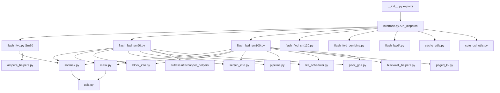

# Diagram: FA4 Module Dependency Map

Companion to [10-fa4-cute.md](../10-fa4-cute.md).

## Core dependency graph

## Responsibility cheat sheet

| Module | Owns |
|--------|------|
| `interface.py` | Public API, arch/tile heuristics, compile + cache, tensor checks |
| `flash_fwd*.py` | Architecture-specific forward kernels |
| `flash_bwd*.py` | Backward (+ preprocess/postprocess helpers) |
| `softmax.py` | Online softmax, score_mod hooks |
| `mask.py` | Causal / local / block-sparse / mask_mod |
| `block_info.py` | n/m block ranges for causal, local, split |
| `pipeline.py` | Multi-stage copy-compute circular buffers |
| `tile_scheduler.py` | Persistent / varlen / CLC-style scheduling |
| `paged_kv.py` | Paged KV cache loads |
| `pack_gqa.py` | Pack Q heads sharing KV |
| `cache_utils.py` | In-memory + disk JIT caches |

## What depends on what when you change code

| If you change… | Re-read / retest |
|----------------|------------------|
| Softmax numerics | All fwd/bwd; combine; score_mod tests |
| Causal block ranges | `block_info.py`, mask tests, varlen |
| Tile sizes in `interface.py` | Perf benches + correctness across hdim |
| Pipeline barriers | Hang risk — [`AI/DEBUG_2CTA.md`](../../AI/DEBUG_2CTA.md) |
| Compile key / cache fingerprint | `tests/cute/test_cache_utils.py` |
