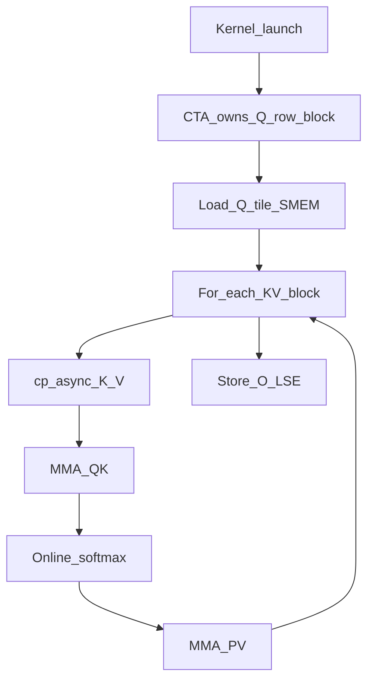
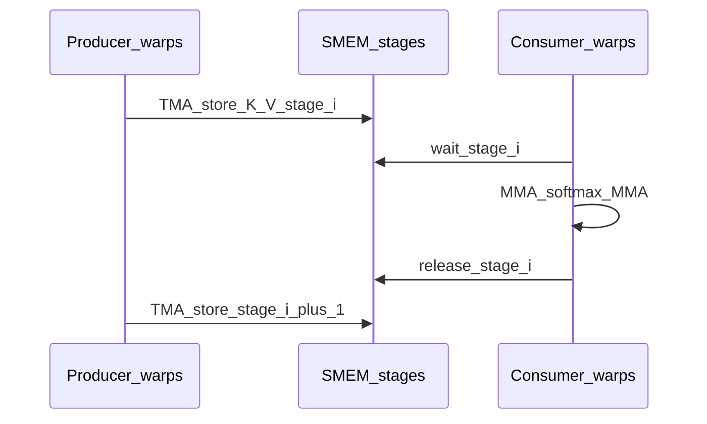

# Diagram: Kernel Execution Across Generations

Companion to [04-theory-parallelism.md](../04-theory-parallelism.md).

## FA2-style grid (Ampere CUDA)

```text
gridDim = (num_m_blocks, batch, num_heads)

        batch
       ┌─────────────────────►
 heads │  CTA(m0,b0,h0) CTA(m1,b0,h0) ...
       │  CTA(m0,b0,h1) ...
       ▼

Each CTA:
  - loads Q[m_block] for (b, h)
  - loops n_blocks over K/V
  - writes O[m_block], LSE[m_block]
```



## FA3 / FA4 Hopper: warp-specialized pipeline

```text
Within one CTA (simplified):

  Producer warps          Consumer warps
  ──────────────          ──────────────
  issue TMA Q/K/V    →    wait buffer ready
  advance pipeline        WGMMA QK
                          softmax + rescale
                          WGMMA PV
                          signal buffer free
```

Ping-pong / multi-stage SMEM buffers hide HBM latency behind MMA. See `hopper/mainloop_fwd_sm90_tma_gmma_ws.hpp` and FA4 `flash_fwd_sm90.py` + `pipeline.py`.



## FA4 Blackwell extras

| Mechanism | Role |
|-----------|------|
| Persistent CTA / CLC scheduler | CTA pulls next tiles instead of one-tile-per-CTA only |
| SplitKV | Multiple CTAs on one Q-block’s KV range |
| 2CTA (cluster) | Two CTAs cooperate for large MMA / hdim patterns |
| UMMA | Blackwell matrix units |

Debug hangs in 2CTA/barrier code with [`AI/DEBUG_2CTA.md`](../../AI/DEBUG_2CTA.md).

## Thread roles (mental model)

| Generation | Who loads | Who computes softmax | Sync |
|------------|-----------|----------------------|------|
| Triton | Same program (compiler schedules) | Same | Implicit barriers |
| FA2 | Threads issue `cp.async` | Same CTA warps | CTA barriers |
| FA3/FA4 SM90 | Producer warps + TMA | Consumer warps | Pipeline mbarriers |
| FA4 SM100 | TMA/UMMA paths + optional 2CTA | Consumer / MMA paths | Cluster + pipeline barriers |
