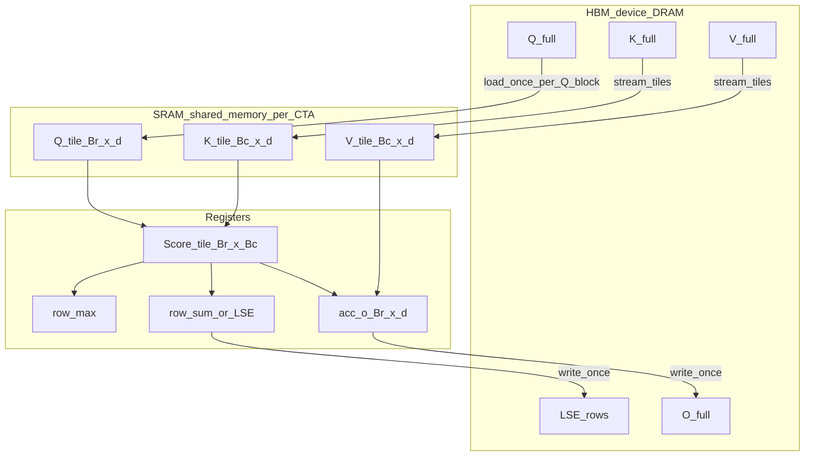

# Diagram: Memory Hierarchy and Tiling

Companion to [01-gpu-primer.md](../01-gpu-primer.md) and [02-theory-io-and-tiling.md](../02-theory-io-and-tiling.md).

## HBM vs SRAM vs registers



**Naïve attention** would also place a full `S` / `P` of shape `N×N` in HBM between steps. FlashAttention never does.

## One CTA’s traffic pattern (forward)

```text
HBM Q ──► SMEM/regs Q_tile ─────────────────────────────► (reuse across KV loop)
HBM K ──► SMEM K_tile_0 ──► scores ──► softmax upd ──► acc_o
HBM V ──► SMEM V_tile_0 ───────────────────────────────►
HBM K ──► SMEM K_tile_1 ──► scores ──► rescale+upd ──► acc_o
HBM V ──► SMEM V_tile_1 ───────────────────────────────►
 ...
acc_o, LSE ──► HBM O, LSE
```

Bytes from HBM scale like **O(N d)** per head for Q/K/V/O, not **O(N²)** for scores.

## Tile geometry

```text
                 KV sequence (N_k)
            ┌──────┬──────┬──────┐
            │ Bc   │ Bc   │ Bc   │
     ┌──────┼──────┼──────┼──────┤
Q    │ Br   │ S00  │ S01  │ S02  │  ← one CTA often owns one Br row-block
seq  ├──────┼──────┼──────┼──────┤     and loops across Bc columns
(N_q)│ Br   │ S10  │ S11  │ S12  │
     └──────┴──────┴──────┴──────┘

Sij lives only ephemerally in registers/SMEM for that step.
```

Typical teaching sizes: `Br = Bc = 64` or `128` (exact values vary by arch, head dim, causal, and generation).

## Capacity constraint (why tiles cannot be huge)

Rough shared-memory budget for a CTA (illustrative):

```text
bytes ≈ Br*d*sizeof(elem)      # Q
      + stages * Bc*d*sizeof   # K (and V) pipeline stages
      + extras (O buffers, barriers, metadata)
```

Must fit in the SM’s SMEM limit (and leave room for occupancy). Register pressure from `acc_o` (`Br × d` accumulators in FP32) is the other hard constraint.
