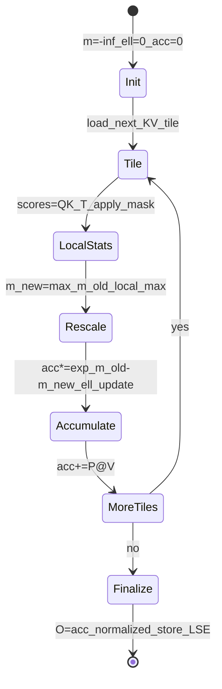
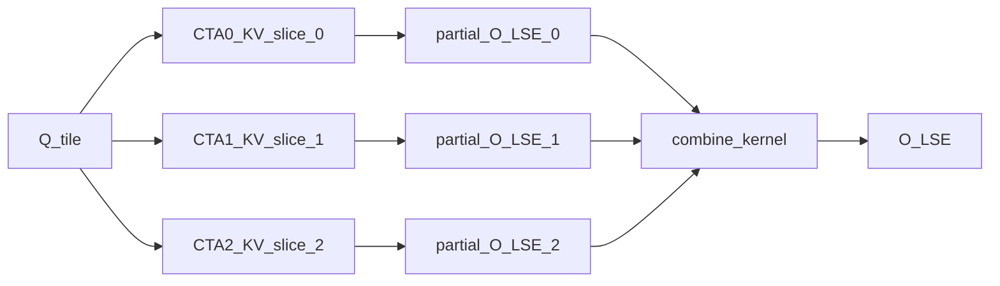

# Diagram: Online Softmax Flow

Companion to [03-theory-online-softmax.md](../03-theory-online-softmax.md).

## Per-row state machine (one Q row inside a Br tile)



## Rescale algebra (one step)

```text
Before tile i:   m_old, ℓ_old, acc_old   (acc holds unnormalized weighted V sum)

local_max = max(scores_tile)
m_new     = max(m_old, local_max)
α         = exp(m_old - m_new)          # ≤ 1

P_tile    = exp(scores_tile - m_new)    # may include scale in the exp argument
ℓ_new     = α * ℓ_old + sum(P_tile)
acc_new   = α * acc_old + P_tile @ V_tile

After last tile:
O = acc_new / ℓ_new
LSE = m_new + log(ℓ_new)
```

Equivalent forms store `lse` instead of `ℓ` and use `exp(lse_old - m_new)` in the update (as in Triton `lse_i`).

## Multi-CTA SplitKV (same algebra, coarser grain)



Combine merges partial `(O, LSE)` with the same max/exp rescale identities. Implementation: [`flash_attn/cute/flash_fwd_combine.py`](../../flash_attn/cute/flash_fwd_combine.py).

## Where rescale sits in the inner loop

```text
for n_block in range(n_block_min, n_block_max):
    load K_n, V_n                          # async / TMA / cp.async
    S = Q_tile @ K_n.T                     # MMA
    apply mask / score_mod on S
    online_softmax_update(S) → rescale acc_o, update m, ℓ
    acc_o += P @ V_n                       # MMA
store O, LSE
```

Everything between “load” and “store” is designed so **S never leaves the CTA**.
